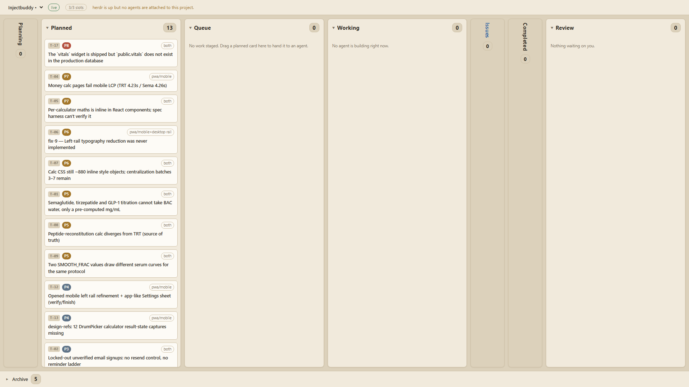

# herdr-kanban

A local Kanban board for work assigned to coding agents. Markdown cards in each project's `TASKS/` folders are the durable record; the board moves cards, launches agents through herdr or detached CLI processes, and shows live progress.



## Start

Requires Windows 11, Node 20+, and the selected Claude Code or Codex CLI on `PATH`. Interactive agents additionally require herdr 0.8.0+. There are no npm dependencies.

From this folder, run `.\kanban.ps1` to launch the board at `http://127.0.0.1:7777`; stop it with `.\kanban.ps1 -Stop`. Configure project paths and agent settings in `board.config.json`. Check the live board for current cards and agent state.

## Read more when needed

- [HOW-IT-WORKS.md](HOW-IT-WORKS.md): card lifecycle, agent handoffs, audit and recovery, settings, and safe operation.
- [hkb.mjs](hkb.mjs): CLI used for card handoffs.
- [test.mjs](test.mjs): focused Node tests. Run the whole suite with `node run-tests.mjs`.

## Optional agent tools

Card-owned plans with a Check receive an independent check in their unchanged card
checkout before automatic Queue promotion. PASS requires correct execution failing
on the AC assertion and verified selectors, routes, counts, fixtures and files.
FAIL returns to Planning with `Plan check: ...` feedback, without a Builder return.
The Planner's Base-check rule still applies. Set `planCheck: false` in
board.config.json (or POST /api/config) to disable this gate.
`agentSettings.global.plancheck` defaults to Claude, `claude-sonnet-5`, reasoning
`medium`; card overrides use `Plancheck engine/model/reasoning`.

Builders, Planners, Reviewers and plan checks can run without interactive panes. Set this in
`board.config.json`, or send the same JSON to `POST /api/config`:

```json
{"agentBackend":{"builder":"headless","planner":"headless","reviewer":"headless","plancheck":"headless"}}
```

The default is `"herdr"`. `"headless"` as a single value selects all four supported
roles. To enable only Builders, merge `"builder":"headless"` into the role map;
unspecified roles use herdr. Switching settings does not move existing agents.
Headless agents receive their full task at process launch, keep logs and a durable
registry in `.agents/`, and resume their recorded session for corrections after
exit. Opening an agent uses a Windows Terminal tab with `scripts/agent-view.mjs`:
messages, tool inputs and short results are readable while the raw log stays intact.
Closing the viewer leaves the agent running; closing the agent kills its process tree.
Windows requires `wt` and a native CLI executable or the standard npm installation.

Phase 2 (Planners) is implemented: headless launches bypass workspace/shell startup
and receive the full prompt at launch. Corrections resume the recorded session and
retain assignment ownership and counters. Exits without handoff use the existing
grace period, one fresh Planner fallback, then Owner escalation; Enter recovery is
only used for herdr panes. Exited sessions stay available after handoff until archive.
Phase 3 (Builders) is implemented: launches receive the full task in the card
worktree with the same engine, model and launch arguments. Bindings capture the
JSON session id; implementation corrections resume that session, including repeated
identical corrections. Process exits use the existing handoff and no-handoff routes
and counters immediately. Completed handoffs preserve logs, retire the process and
continue through integration. Headless launches skip shell readiness, typed prompt
files, Enter recovery and uncertain typing states. Explicit restricted dispatch
still refuses before worktree preparation because the native guard runtime is
unverified; ordinary Builders do not enable experimental hooks.

Remaining herdr-only surfaces: project/orchestrator chat sessions and windows,
interactive pane recovery (including staged Reviewer Enter recovery), and the
PowerShell launcher's herdr startup and `watch-kanban.ps1` herdr supervision.
All four managed roles can now run headless;
retiring herdr entirely still requires replacing those chat/startup surfaces.

External hook follow-up (not edited here): `_roles/context-guard.mjs:13`,
`_roles/load-state.mjs:12`, and `_roles/resume-after-clear.mjs:12` should accept
`BOARD_AGENT_ID` wherever they check `HERDR_PANE_ID`. Headless launches currently
set both markers so those existing hooks already skip board agents.

For browser checks, prefer headless Chrome DevTools MCP when available; use headless Playwright if needed. Load browser instructions only for a browser task. Use Windows Computer Use only when browser tools cannot cover the task.

MIT licence.
